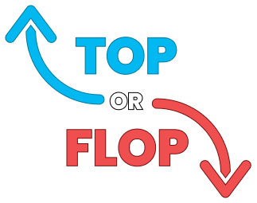

  

# Top or Flop
### Your seasonal most hyped animeList

Top or Flop is a personalized anime-list where you can add your main titles of the season that you may you think that they can possibly gain prominence and popularity in the community.

- Search a anime title;
- grab then to categories: **top** or **flop**;
- Save your list and finish! 🙆‍♀️

## Tech

Dillinger uses a number of open source projects to work properly:

Frontend
- **[NextJS]** - React structure.
- **[RecoilJS]** - State Library.
- **[SWR]** - Api hooks requisitions.
- **[ChakraUI]** - User interface and animations.

Backend
- **[ASP.NET CORE]** - API Rest.
- **[Swagger]** - API Documentation.
- **[PostgresQL]** - Main database.
- **[JWT]** - User authentication.

UI/UX
- Figma - [Access Here](https://www.figma.com/file/S2RRSHQ21lJH9f6rclspzC/Anime-Bingo?node-id=0%3A1) 

## Authors
- **Matheus Littig** - *FullStack Development and UI/UX Design* - [MatheusLittig](https://github.com/MatheusLittig)

## License

MIT

**Free Software, Hell Yeah!**
